# Mermaid — примеры блок-схем, графиков и диаграмм

> Большая практическая шпаргалка по Mermaid.Ё
> Код из примеров можно вставлять в Markdown-файлы, GitHub/GitLab, редакторы с поддержкой Mermaid и Mermaid Live Editor.

---

## 1. Базовая структура Mermaid

Минимальный блок:

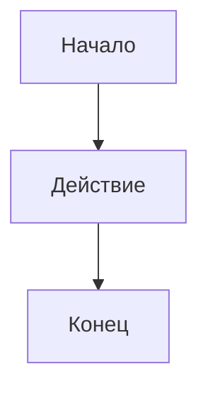

Общий формат:

```text
```mermaid
ТИП_ДИАГРАММЫ
    код
```
```

> Внутри этого файла тройные обратные кавычки используются как примеры кода.

---

# 2. Блок-схемы — Flowchart

## 2.1. Простая последовательность

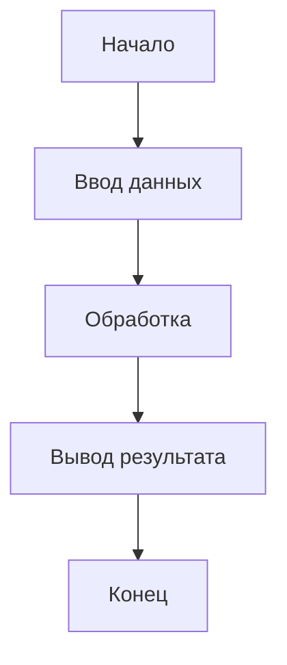

## 2.2. Вертикальная и горизонтальная ориентация

### Сверху вниз

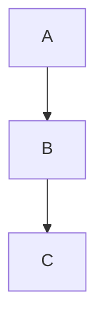

### Слева направо

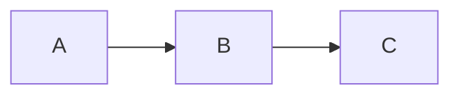

Другие направления:

```text
TD — Top Down
TB — Top to Bottom
BT — Bottom to Top
LR — Left to Right
RL — Right to Left
```

---

## 2.3. Основные формы блоков

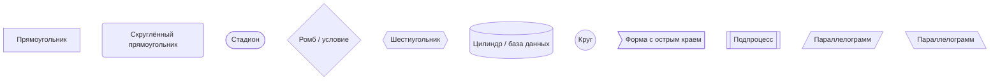

---

## 2.4. Классическая блок-схема алгоритма

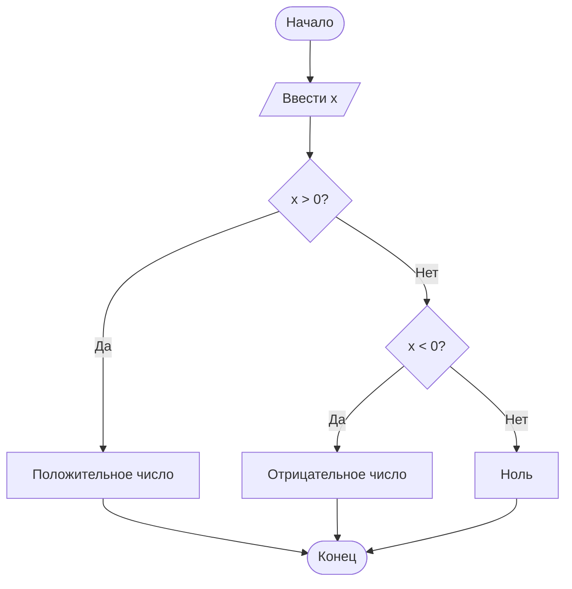

---

## 2.5. Условие с двумя ветвями

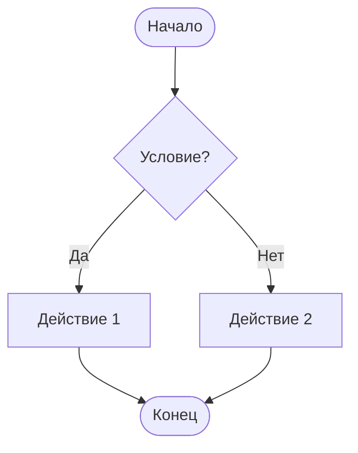

---

## 2.6. Условие с тремя и более вариантами

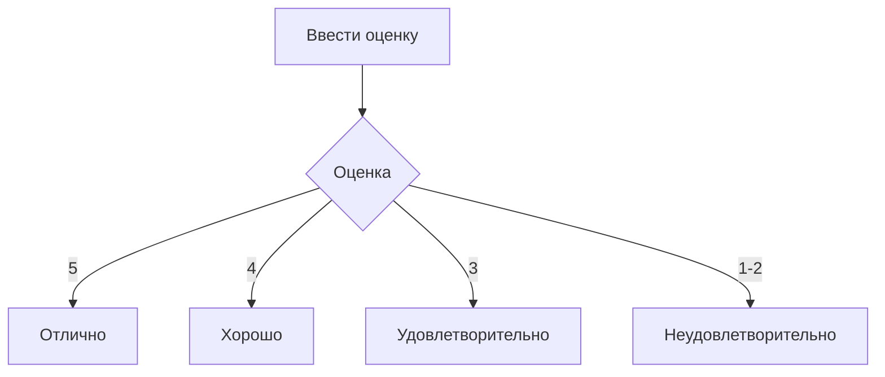

---

## 2.7. Цикл

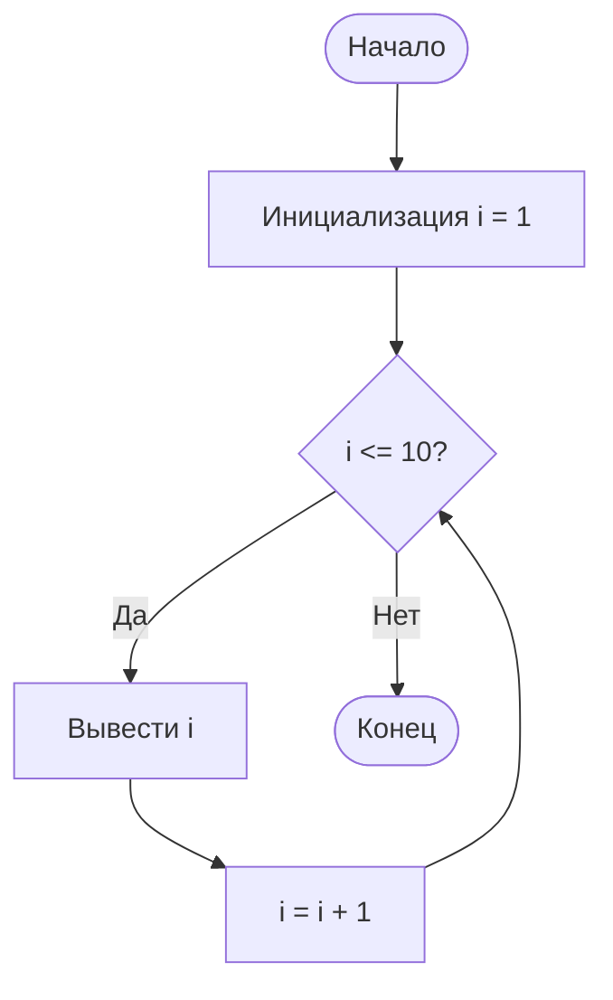

---

## 2.8. Цикл while

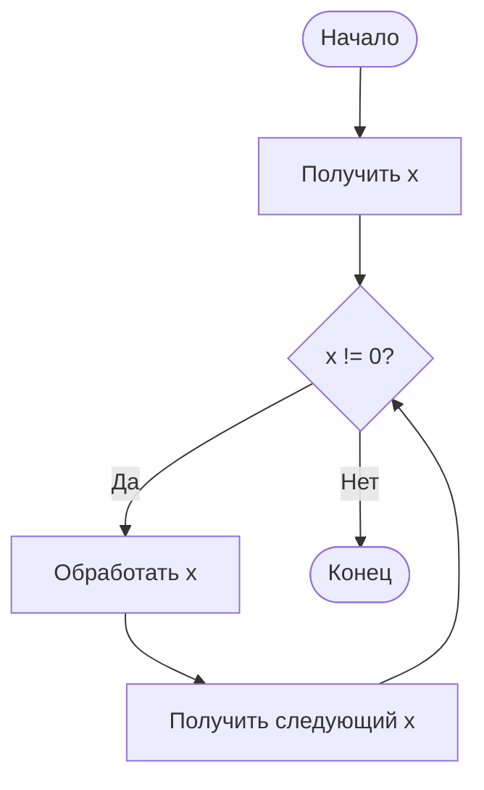

---

## 2.9. Вложенное условие

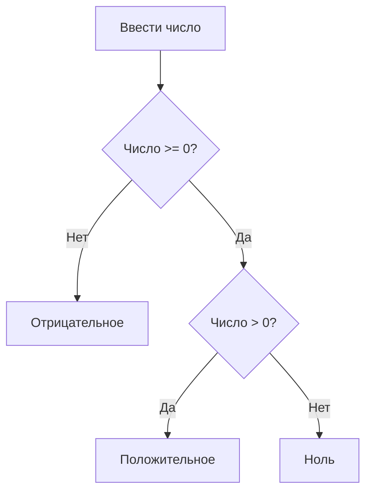

---

## 2.10. Параллельные ветки

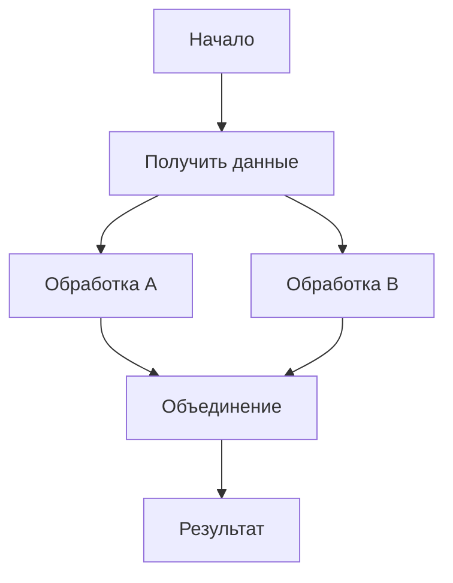

---

## 2.11. Подпроцесс

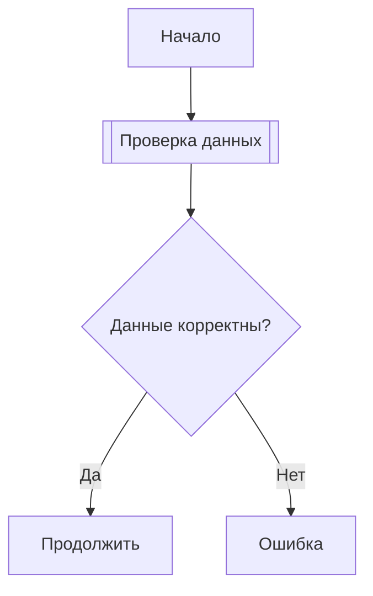

---

## 2.12. Связи с подписями

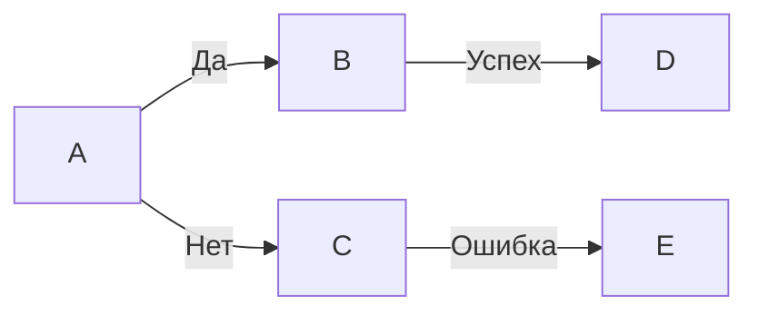

---

## 2.13. Разные типы стрелок

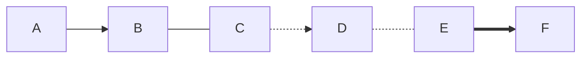

Основные варианты:

```text
-->   обычная стрелка
---   линия без стрелки
-.->  пунктирная стрелка
-.-   пунктирная линия
==>   толстая стрелка
```

---

## 2.14. Подпись на стрелке

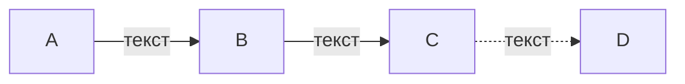

---

## 2.15. Обратная связь

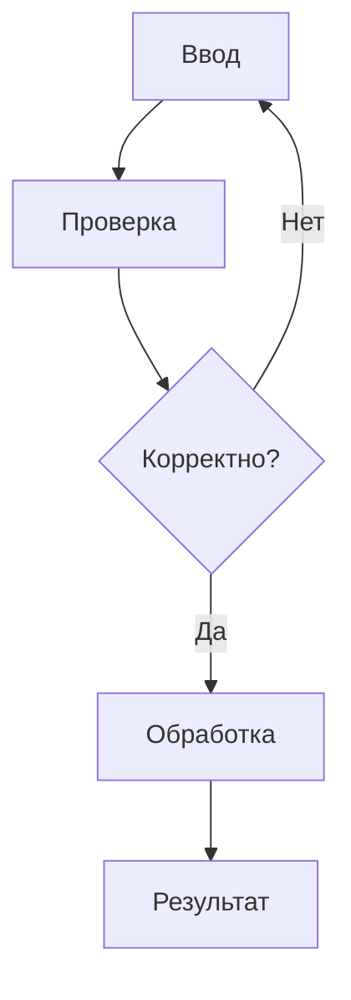

---

## 2.16. Сложный алгоритм

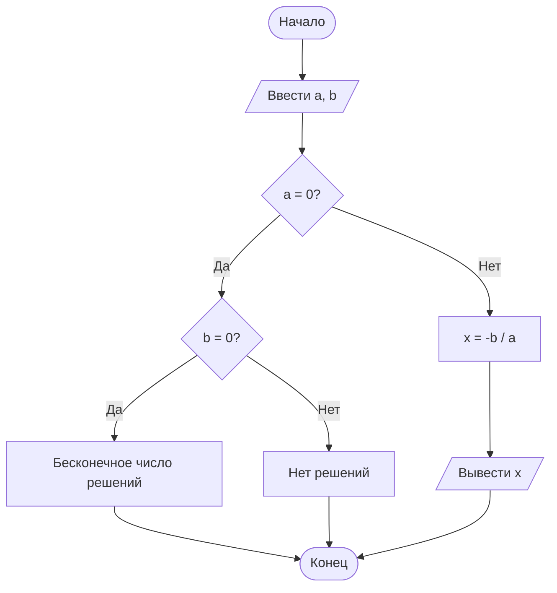

---

# 3. Диаграмма последовательности — Sequence Diagram

## 3.1. Простая последовательность

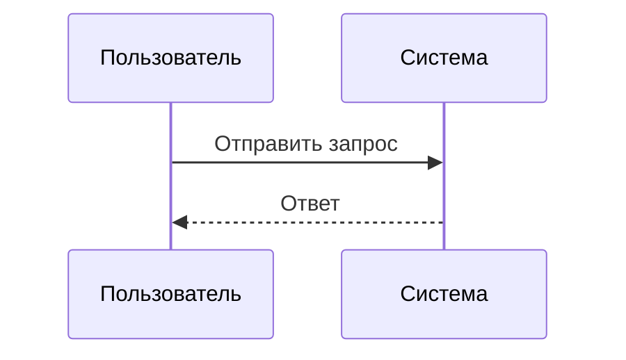

## 3.2. Несколько участников

```mermaid
sequenceDiagram
    participant User as Пользователь
    participant Browser as Браузер
    participant Server as Сервер
    participant DB as База данных

    User->>Browser: Открыть страницу
    Browser->>Server: HTTP-запрос
    Server->>DB: Запрос данных
    DB-->>Server: Данные
    Server-->>Browser: HTML
    Browser-->>User: Страница
```

## 3.3. Условие

```mermaid
sequenceDiagram
    participant U as Пользователь
    participant S as Система

    U->>S: Ввести пароль

    alt Пароль правильный
        S-->>U: Вход выполнен
    else Пароль неправильный
        S-->>U: Ошибка
    end
```

## 3.4. Цикл

```mermaid
sequenceDiagram
    participant A
    participant B

    loop Каждую минуту
        A->>B: Проверка статуса
        B-->>A: Текущий статус
    end
```

---

# 4. Диаграмма классов — Class Diagram

## 4.1. Простой класс

```mermaid
classDiagram
    class Person {
        +String name
        +int age
        +sayHello()
    }
```

## 4.2. Несколько классов

```mermaid
classDiagram
    class User {
        +String name
        +login()
        +logout()
    }

    class Order {
        +int id
        +create()
        +cancel()
    }

    User "1" --> "*" Order : создаёт
```

## 4.3. Наследование

```mermaid
classDiagram
    class Animal {
        +eat()
        +sleep()
    }

    class Dog {
        +bark()
    }

    class Cat {
        +meow()
    }

    Animal <|-- Dog
    Animal <|-- Cat
```

## 4.4. Интерфейс

```mermaid
classDiagram
    class Printable {
        <<interface>>
        +print()
    }

    class Document {
        +print()
    }

    Printable <|.. Document
```

---

# 5. Диаграмма состояний — State Diagram

## 5.1. Простая

```mermaid
stateDiagram-v2
    [*] --> Ожидание
    Ожидание --> Работа
    Работа --> Ожидание
    Работа --> Ошибка
    Ошибка --> Ожидание
    Ожидание --> [*]
```

## 5.2. С условиями

```mermaid
stateDiagram-v2
    [*] --> Авторизация
    Авторизация --> Система: пароль верный
    Авторизация --> Ошибка: пароль неверный
    Ошибка --> Авторизация: повторить
    Система --> [*]
```

---

# 6. Диаграмма сущность-связь — ER Diagram

## 6.1. Простая база данных

```mermaid
erDiagram
    USER ||--o{ ORDER : creates
    ORDER ||--|{ PRODUCT : contains

    USER {
        int id
        string name
        string email
    }

    ORDER {
        int id
        date created_at
    }

    PRODUCT {
        int id
        string name
        float price
    }
```

## 6.2. Основные обозначения связей

```text
||--||  один к одному
||--o{  один ко многим
}o--o{  многие ко многим
||--|{  один или несколько
```

---

# 7. Диаграмма Ганта — Gantt

## 7.1. Простой план

```mermaid
gantt
    title План проекта
    dateFormat YYYY-MM-DD

    section Подготовка
    Анализ требований :a1, 2026-09-01, 3d
    Проектирование :a2, after a1, 5d

    section Разработка
    Программирование :b1, after a2, 10d
    Тестирование :b2, after b1, 5d

    section Завершение
    Релиз :after b2, 1d
```

## 7.2. Веха

```mermaid
gantt
    title Этапы проекта
    dateFormat YYYY-MM-DD

    section Этап
    Работа :a1, 2026-09-01, 10d
    Релиз :milestone, m1, after a1, 0d
```

---

# 8. Круговая диаграмма — Pie Chart

```mermaid
pie title Распределение времени
    "Учёба" : 40
    "Сон" : 30
    "Отдых" : 20
    "Спорт" : 10
```

Ещё пример:

```mermaid
pie title Распределение бюджета
    "Еда" : 35
    "Транспорт" : 20
    "Развлечения" : 15
    "Учёба" : 10
    "Другое" : 20
```

---

# 9. График XY — xychart

> Подходит для простых столбчатых и линейных графиков.

## 9.1. Столбчатый график

```mermaid
xychart-beta
    title "Продажи по месяцам"
    x-axis [Янв, Фев, Мар, Апр, Май]
    y-axis "Продажи" 0 --> 100
    bar [20, 45, 60, 35, 80]
```

## 9.2. Линейный график

```mermaid
xychart-beta
    title "Изменение температуры"
    x-axis [Пн, Вт, Ср, Чт, Пт]
    y-axis "Температура" -10 --> 30
    line [5, 8, 12, 10, 15]
```

## 9.3. Несколько рядов

```mermaid
xychart-beta
    title "Сравнение показателей"
    x-axis [1, 2, 3, 4, 5]
    y-axis "Значение" 0 --> 100
    line [10, 25, 40, 55, 70]
    line [70, 60, 50, 40, 30]
```

---

# 10. Git-граф

## 10.1. Простая история Git

```mermaid
gitGraph
    commit
    commit
    branch develop
    checkout develop
    commit
    commit
    checkout main
    merge develop
    commit
```

## 10.2. Ветки

```mermaid
gitGraph
    commit id: "Initial"
    branch feature
    checkout feature
    commit id: "Feature 1"
    commit id: "Feature 2"
    checkout main
    commit id: "Main change"
    merge feature
```

---

# 11. Диаграмма путешествия пользователя — User Journey

```mermaid
journey
    title Путь пользователя в интернет-магазине

    section Поиск
      Открывает сайт: 5: Пользователь
      Ищет товар: 4: Пользователь

    section Покупка
      Добавляет в корзину: 5: Пользователь
      Оформляет заказ: 3: Пользователь

    section Получение
      Получает заказ: 5: Пользователь
```

---

# 12. Mindmap — интеллект-карта

```mermaid
mindmap
  root((Программирование))
    Языки
      Python
      Java
      C++
      JavaScript
    Алгоритмы
      Сортировка
      Поиск
      Графы
    Базы данных
      SQL
      NoSQL
    Инструменты
      Git
      Docker
```

---

# 13. Timeline — временная шкала

```mermaid
timeline
    title История проекта

    2024 : Идея
    2025 : Разработка
    2026 : Тестирование
         : Первый релиз
```

---

# 14. Quadrant Chart — квадрант

```mermaid
quadrantChart
    title Приоритет задач
    x-axis Низкая срочность --> Высокая срочность
    y-axis Низкая важность --> Высокая важность

    "Задача A": [0.2, 0.8]
    "Задача B": [0.8, 0.9]
    "Задача C": [0.3, 0.2]
    "Задача D": [0.7, 0.3]
```

---

# 15. Requirement Diagram — требования

```mermaid
requirementDiagram

    requirement user_requirement {
        id: 1
        text: Система должна выполнять вход пользователя
        risk: low
        verifymethod: test
    }

    element system {
        type: system
        docref: login
    }

    system - satisfies -> user_requirement
```

---

# 16. Sankey Diagram — потоки

```mermaid
sankey-beta

Учёба,Математика,30
Учёба,Программирование,40
Учёба,Физика,20
Отдых,Игры,25
Отдых,Видео,15
```

---

# 17. Block Diagram — блочная схема

```mermaid
block-beta
    columns 3

    A["Вход"] B["Обработка"] C["Выход"]

    A --> B
    B --> C
```

## Более сложный пример

```mermaid
block-beta
    columns 3

    A["Пользователь"]
    B["Сервер"]
    C["База данных"]

    A --> B
    B --> C
    C --> B
    B --> A
```

---

# 18. Architecture / C4 Diagram

## 18.1. C4 Context

```mermaid
C4Context
    title Система интернет-магазина

    Person(user, "Пользователь", "Покупатель")
    System(shop, "Интернет-магазин", "Сайт магазина")
    System_Ext(payment, "Платёжная система", "Обрабатывает платежи")

    Rel(user, shop, "Покупает товары")
    Rel(shop, payment, "Оплачивает заказ")
```

## 18.2. C4 Container

```mermaid
C4Container
    Person(user, "Пользователь")

    System_Boundary(system, "Интернет-магазин") {
        Container(web, "Web App", "HTML/CSS/JS")
        Container(api, "API", "Python")
        ContainerDb(db, "Database", "PostgreSQL")
    }

    Rel(user, web, "Использует")
    Rel(web, api, "HTTP")
    Rel(api, db, "SQL")
```

---

# 19. Дерево

```mermaid
flowchart TD
    A[Компьютер] --> B[Аппаратная часть]
    A --> C[Программная часть]

    B --> B1[Процессор]
    B --> B2[ОЗУ]
    B --> B3[Накопитель]

    C --> C1[ОС]
    C --> C2[Приложения]
```

---

# 20. Организационная структура

```mermaid
flowchart TD
    CEO[Директор]
    CEO --> CTO[Технический директор]
    CEO --> CFO[Финансовый директор]
    CEO --> HR[HR]

    CTO --> DEV[Разработчики]
    CTO --> QA[Тестировщики]
    CFO --> ACCOUNT[Бухгалтерия]
    HR --> RECRUIT[Рекрутинг]
```

---

# 21. Сетевая схема

```mermaid
flowchart LR
    Internet((Интернет)) --> Router[Роутер]
    Router --> Switch[Коммутатор]

    Switch --> PC1[ПК 1]
    Switch --> PC2[ПК 2]
    Switch --> Server[Сервер]
    Server --> DB[(База данных)]
```

---

# 22. Архитектура приложения

```mermaid
flowchart TD
    User[Пользователь] --> Frontend[Frontend]
    Frontend --> API[Backend API]

    API --> Auth[Сервис авторизации]
    API --> Logic[Бизнес-логика]
    API --> DB[(Database)]

    Logic --> Cache[(Cache)]
    Logic --> External[Внешний API]
```

---

# 23. Алгоритм сортировки

```mermaid
flowchart TD
    A([Начало]) --> B[/Получить массив/]
    B --> C[Сравнить соседние элементы]
    C --> D{Элементы в неправильном порядке?}
    D -- Да --> E[Поменять местами]
    D -- Нет --> F[Перейти дальше]
    E --> F
    F --> G{Конец прохода?}
    G -- Нет --> C
    G -- Да --> H{Массив отсортирован?}
    H -- Нет --> C
    H -- Да --> I[/Вывести массив/]
    I --> J([Конец])
```

---

# 24. Авторизация

```mermaid
sequenceDiagram
    actor User as Пользователь
    participant App as Приложение
    participant Server as Сервер
    participant DB as БД

    User->>App: Ввод логина и пароля
    App->>Server: POST /login
    Server->>DB: Проверка пользователя
    DB-->>Server: Данные пользователя

    alt Данные верны
        Server-->>App: Токен
        App-->>User: Вход выполнен
    else Данные неверны
        Server-->>App: Ошибка 401
        App-->>User: Неверный логин или пароль
    end
```

---

# 25. Онлайн-магазин

```mermaid
flowchart TD
    A[Главная страница] --> B[Каталог]
    B --> C[Карточка товара]
    C --> D{Добавить в корзину?}
    D -- Да --> E[Корзина]
    D -- Нет --> B

    E --> F[Оформление заказа]
    F --> G[Оплата]
    G --> H{Оплата успешна?}
    H -- Да --> I[Заказ создан]
    H -- Нет --> J[Ошибка оплаты]
```

---

# 26. Стилизация блок-схем

Можно задавать классы:

```mermaid
flowchart TD
    A[Начало] --> B[Процесс]
    B --> C{Условие}
    C --> D[Конец]

    classDef start fill:#d4edda,stroke:#198754,stroke-width:2px
    classDef process fill:#cfe2ff,stroke:#0d6efd,stroke-width:2px
    classDef decision fill:#fff3cd,stroke:#ffc107,stroke-width:2px
    classDef end fill:#f8d7da,stroke:#dc3545,stroke-width:2px

    class A start
    class B process
    class C decision
    class D end
```

---

# 27. Стилизация отдельных связей

```mermaid
flowchart LR
    A --> B
    B --> C
    C --> D

    linkStyle 0 stroke-width:4px
    linkStyle 1 stroke-dasharray:5 5
```

---

# 28. Subgraph — группы элементов

```mermaid
flowchart TD
    subgraph Пользователь
        A[Браузер]
        B[Телефон]
    end

    subgraph Сервер
        C[API]
        D[Database]
    end

    A --> C
    B --> C
    C --> D
```

## Направление внутри группы

```mermaid
flowchart LR
    subgraph Frontend
        direction TB
        A[HTML]
        B[CSS]
        C[JavaScript]
    end

    subgraph Backend
        direction TB
        D[API]
        E[Logic]
        F[Database]
    end

    Frontend --> Backend
```

---

# 29. Несколько типов диаграмм в одном проекте

Например, можно описать систему сразу несколькими Mermaid-блоками:

### Архитектура

```mermaid
flowchart LR
    User --> Frontend --> Backend --> Database
```

### Взаимодействие

```mermaid
sequenceDiagram
    User->>Frontend: Запрос
    Frontend->>Backend: API
    Backend->>Database: SQL
    Database-->>Backend: Данные
    Backend-->>Frontend: JSON
    Frontend-->>User: Страница
```

### Структура классов

```mermaid
classDiagram
    User --> Order
    Order --> Product
```

---

# 30. Полезные конструкции

## Текст внутри блока

```mermaid
flowchart TD
    A["Текст с пробелами"]
    B["Текст: с двоеточием"]
    C["Текст (с круглыми скобками)"]
```

## Специальные символы

```mermaid
flowchart LR
    A["Начало"] --> B["Ввод: x"]
    B --> C["Результат = x²"]
```

## ID и отображаемый текст

```mermaid
flowchart LR
    node1["Это отображаемый текст"]
    node2["Другой текст"]

    node1 --> node2
```

---

# 31. Быстрая шпаргалка по типам

| Тип | Начало кода | Для чего |
|---|---|---|
| Flowchart | `flowchart TD` | Блок-схемы, алгоритмы |
| Sequence | `sequenceDiagram` | Взаимодействие объектов |
| Class | `classDiagram` | Классы и ООП |
| State | `stateDiagram-v2` | Состояния системы |
| ER | `erDiagram` | Базы данных |
| Gantt | `gantt` | Планирование |
| Pie | `pie` | Круговые диаграммы |
| XY Chart | `xychart-beta` | Графики и столбчатые диаграммы |
| Git | `gitGraph` | История Git |
| Journey | `journey` | Путь пользователя |
| Mindmap | `mindmap` | Интеллект-карты |
| Timeline | `timeline` | Хронология |
| Quadrant | `quadrantChart` | Квадранты |
| Requirement | `requirementDiagram` | Требования |
| Sankey | `sankey-beta` | Потоки |
| Block | `block-beta` | Блочные схемы |
| C4 | `C4Context` / `C4Container` | Архитектура |

---

# 32. Универсальный шаблон блок-схемы

```mermaid
flowchart TD
    Start([Начало])
    Input[/Ввод данных/]
    Process[Обработка]
    Decision{Условие?}
    Action1[Действие 1]
    Action2[Действие 2]
    Output[/Вывод результата/]
    End([Конец])

    Start --> Input
    Input --> Process
    Process --> Decision
    Decision -- Да --> Action1
    Decision -- Нет --> Action2
    Action1 --> Output
    Action2 --> Output
    Output --> End
```

---

# 33. Универсальный шаблон графика

```mermaid
xychart-beta
    title "Название графика"
    x-axis [A, B, C, D, E]
    y-axis "Значение" 0 --> 100
    bar [10, 20, 30, 40, 50]
```

---

# 34. Универсальный шаблон диаграммы последовательности

```mermaid
sequenceDiagram
    participant A as Участник 1
    participant B as Участник 2

    A->>B: Запрос
    B-->>A: Ответ
```

---

# 35. Универсальный шаблон диаграммы классов

```mermaid
classDiagram
    class ClassA {
        +attribute
        +method()
    }

    class ClassB {
        +attribute
        +method()
    }

    ClassA --> ClassB
```

---

# 36. Универсальный шаблон состояний

```mermaid
stateDiagram-v2
    [*] --> State1
    State1 --> State2
    State2 --> State3
    State3 --> [*]
```

---

# 37. Универсальный шаблон ER-диаграммы

```mermaid
erDiagram
    USER ||--o{ ORDER : creates
    ORDER ||--|{ PRODUCT : contains

    USER {
        int id
        string name
    }

    ORDER {
        int id
        date date
    }

    PRODUCT {
        int id
        string name
    }
```

---

# 38. Что выбрать для разных задач

```text
Если нужен алгоритм:
    flowchart

Если нужно показать взаимодействие:
    sequenceDiagram

Если нужно показать классы:
    classDiagram

Если нужно показать состояния:
    stateDiagram-v2

Если нужна структура базы данных:
    erDiagram

Если нужен план проекта:
    gantt

Если нужны доли:
    pie

Если нужен обычный график:
    xychart-beta

Если нужна история Git:
    gitGraph

Если нужна интеллект-карта:
    mindmap

Если нужна хронология:
    timeline

Если нужно сравнить приоритеты:
    quadrantChart

Если нужно показать потоки:
    sankey-beta

Если нужна архитектура:
    C4Context / C4Container
```

---

# 39. Большой пример — информационная система

```mermaid
flowchart TD
    User[Пользователь] --> Login[Авторизация]

    Login --> Check{Данные верны?}

    Check -- Нет --> Error[Сообщение об ошибке]
    Error --> Login

    Check -- Да --> Main[Главное меню]

    Main --> Profile[Профиль]
    Main --> Products[Каталог]
    Main --> Orders[Заказы]

    Products --> Product[Товар]
    Product --> Cart[Корзина]
    Cart --> Payment[Оплата]

    Payment --> PaymentCheck{Оплата успешна?}

    PaymentCheck -- Да --> OrderCreated[Заказ создан]
    PaymentCheck -- Нет --> PaymentError[Ошибка оплаты]

    OrderCreated --> Orders
    PaymentError --> Payment

    Profile --> Main
    Orders --> Main
```

---

# 40. Итог

Mermaid позволяет создавать схемы прямо внутри Markdown без отдельных изображений.

Самые полезные конструкции для учебных работ:

```text
flowchart TD
flowchart LR
sequenceDiagram
classDiagram
stateDiagram-v2
erDiagram
gantt
pie
xychart-beta
gitGraph
mindmap
timeline
quadrantChart
block-beta
```

Для обычной школьной блок-схемы чаще всего достаточно:

```mermaid
flowchart TD
    A([Начало]) --> B[/Ввод/]
    B --> C{Условие?}
    C -- Да --> D[Действие 1]
    C -- Нет --> E[Действие 2]
    D --> F[/Вывод/]
    E --> F
    F --> G([Конец])
```
